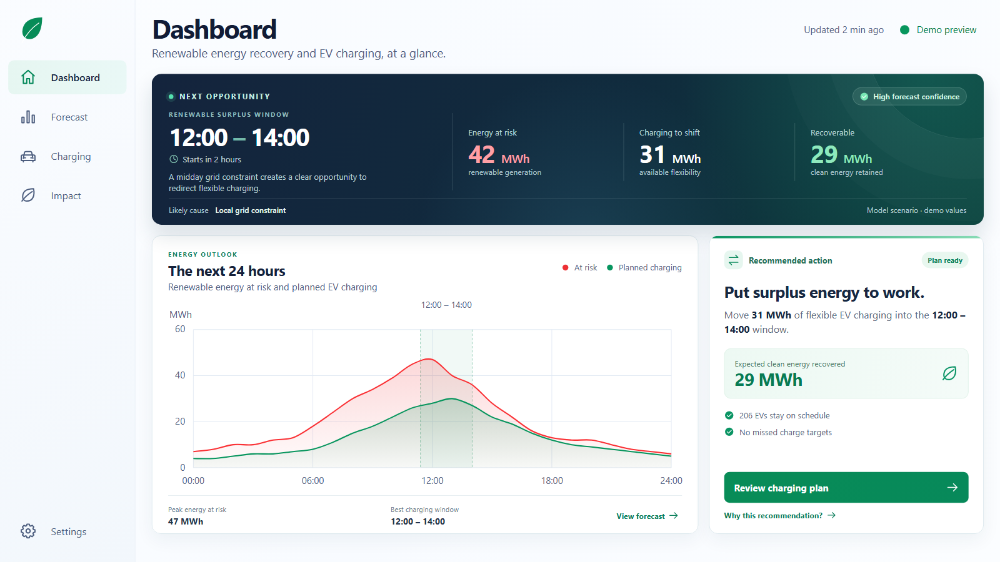

# Frontend

Desktop UI prototype for the renewable energy and EV charging planner. It includes Dashboard, Forecast, Charging, Impact, and Settings screens based on the product designs.



## Run locally

From this directory, run:

```sh
python -m http.server 5173 --bind 127.0.0.1
```

Open <http://127.0.0.1:5173/>. No package installation or build step is required.

## Scope

This is a UI-only prototype. Forecast, charging, and impact figures are demo values. Navigation, settings controls, and explanatory dialogs are presentational; no API or backend is connected. The desktop layout scales to fit the browser viewport without page scrolling.
