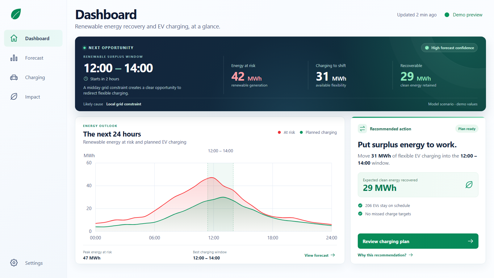
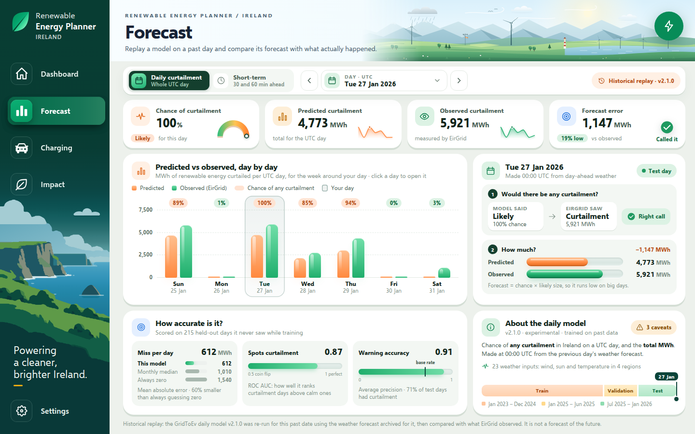

# Frontend

Desktop UI for the renewable energy and EV charging planner. Dashboard, Forecast, Charging, Impact, and Settings share the same navigation, typography, 3D visual language, horizon controls, and light/dark appearance.



## Integrated local run

Configure the hosted model in the project-root `.env`, then double-click `Start-App.cmd` on Windows. Alternatively, from the SaveThePlanet root:

```powershell
python backend/server.py
```

Open http://127.0.0.1:8080. See [backend setup](../backend/README.md) for full instructions.
The backend serves the frontend and `/api/v1/scenario` on the same origin.

The four data screens use the same `/api/v1/scenario` response. `model.js` fetches
and validates it; `scenario.js` reads the backend-derived charging outcomes;
`studio.js` renders the screens with shared components; `app.js` owns navigation
and local presentation preferences. The 30- and 60-minute predictions are
historical model targets, not a live 24-hour forecast. Each result describes a
separate half-hour interval and the two outcomes must not be added together.

Charging accepts total and flexible demand in kWh; Impact displays projected
recovery and remaining energy from that same scenario. Demand inputs reset to
labelled example defaults on reload. Display settings persist in local storage;
the shared flexible-capacity input in MW is authoritative. The API does not
provide vehicle counts, commitments, actual charging or financial savings, so
the UI makes none of those claims.

The former `python -m http.server 5173` command can still serve static files, but
cannot provide the product API: the product screens will show an error there.

## Model outage demo

If GridToEv is offline or returns unusable data, the backend supplies a fixed local
example. The page footer labels results as a simulated fallback;
charging inputs and calculations still work. Settings → Model connection explains
why the model is unavailable, from `/api/v1/health`.
Click **Reload forecast** there after restarting GridToEv to return to model data.
The SaveThePlanet backend must remain running. No external assets are needed.

## Settings

Settings reads its facts from the API rather than hard-coded text: region, energy
interval and forecast targets come from the forecast response; charging inputs and
scenario ID are the values the backend actually used; *About this workspace* lists
the backend scenario methodology; *Model connection* shows `/api/v1/health` (status,
reason code and explanation, model version, response time, last check, service type,
whether an API key is set) plus the data mode and last-updated time. Timezone,
appearance and the display toggles remain local preferences.

## Forecast page

`forecast-explorer.js` and `forecast-explorer.css` hold the page. It replays GridToEv's two
models on dates from their own datasets (`/api/v1/explorer/*`): the daily curtailment model
(chance of any curtailment on a UTC day, and its MWh) and the short-term model (dispatch-down
in one half-hour, 30 or 60 minutes ahead). Every figure is a historical replay compared with
what EirGrid observed, never a live forecast.



- **Toolbar**: model switch, day or half-hour navigator (arrows and a dataset calendar with
  train/validation/test markers) and a "Historical replay" status chip.
- **KPI row**: the model's figures, the observed value and the forecast error, with sparklines,
  a chance gauge or the P10–P90 range.
- **Main chart**: predicted vs observed per day for the week (daily model), or per half-hour
  through the day with the likely range (short-term model). Hover for details; click or use the
  arrow keys to move.
- **Side card**: how the selected day or half-hour turned out, the forecast range, the cause
  split and what flexible load could absorb. Taller screens add the week's calls or the day's
  range hit rate.
- **How accurate is it?** and **About the model**: held-out scores against simple baselines,
  the training timeline with the selected date pinned, and the model's own caveats.

The page fits one 1440×900 screen like the others, so the app is not scaled down for it. Its
charts are `standalone` engine charts in `charts3d.js`: they animate like the other pages without
needing the Dashboard's model data, and everything is instant under reduced motion.

## Charging page

`charging.js` and `charging.css` hold the whole page (loaded after `studio.js` and
`charts3d.js`, so this `renderCharging` replaces the older one). All styles are scoped to
`[data-current-page="charging"]`. Charts use the shared animation engine in `charts3d.js`.

- **KPI row** for the selected forecast half-hour: total and flexible demand (your
  assumptions), energy at risk (model) and potential absorption (upper bound), with
  replay-day profiles as sparklines. Each card has an icon and a percentage: a share for the two
  demand cards, and the selected half-hour against the replay-day average for the two model cards.
- **Charging schedule**: average MW per half-hour of the replay day (`/api/v1/impact/day`):
  renewable supply at risk, charging demand on renewable and
  charging demand on grid, with a hover tooltip.
- **Charging mix**: share of total demand that could use renewable energy at risk, with
  the EV readings (charge equivalents and minimum concurrent ports) stated separately.
- **Chargeable energy opportunity**: predicted curtailment per day from the daily model
  (`/api/v1/explorer/daily/week`), Monday to Sunday, as rounded 3D cube bars. A week picker (arrows and a month calendar) chooses
  the week; weeks outside the daily model's range (`/api/v1/explorer/daily`) or in the future show a
  "no data" message, and days without data are marked in the chart.
- **Best half-hours to charge**: the top five replay-day half-hours ranked by energy at risk
  x event probability, with a 3D energy bar and the likelihood for each.
- **Assumptions** drawer: demand and EV assumptions with field-level validation, plus the
  backend methodology.

Everything is labelled as a historical dataset prediction or example data and an
upper-bound estimate. Times are shown as "forecast half-hours", without a start/end claim.

**Motion.** Figures count up and glide to new values, lines draw in left to right, the donut fills,
week bars grow one after another and the ranked rows slide in, all through the shared engine in
`charts3d.js` or once-only CSS entrances. Live refreshes do not replay them, "Apply" keeps the
current figures dimmed with an "Updating…" note until the new ones glide in, and everything is
instant when the viewer prefers reduced motion.
